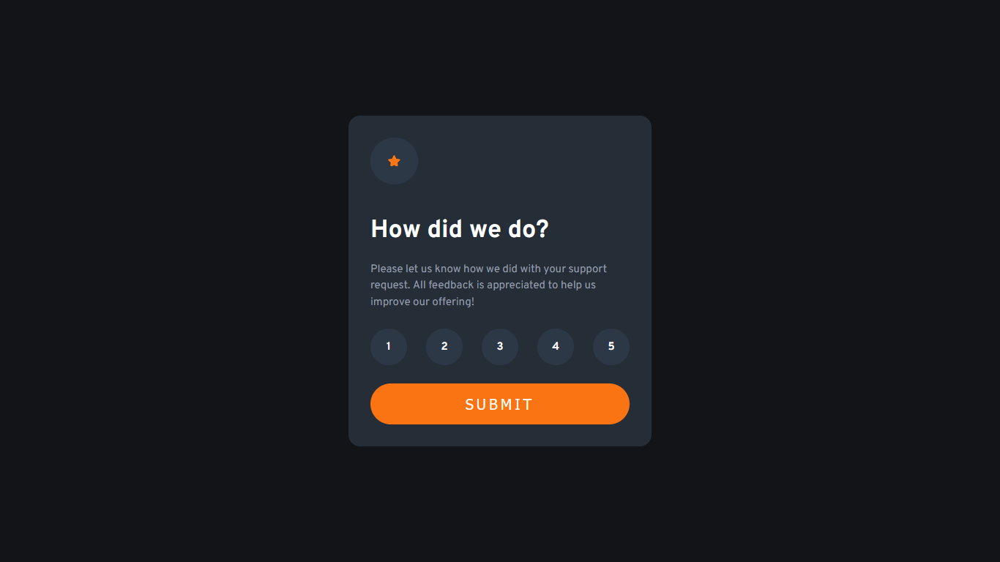
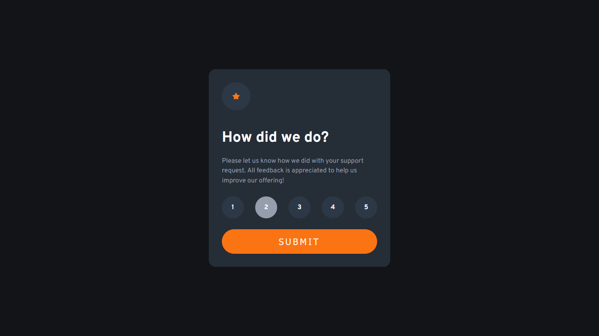
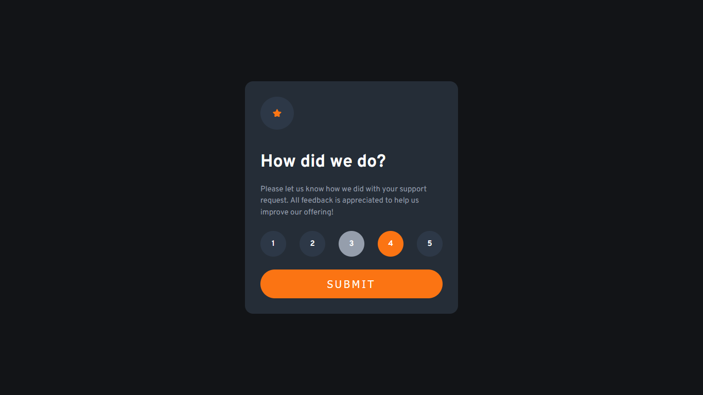
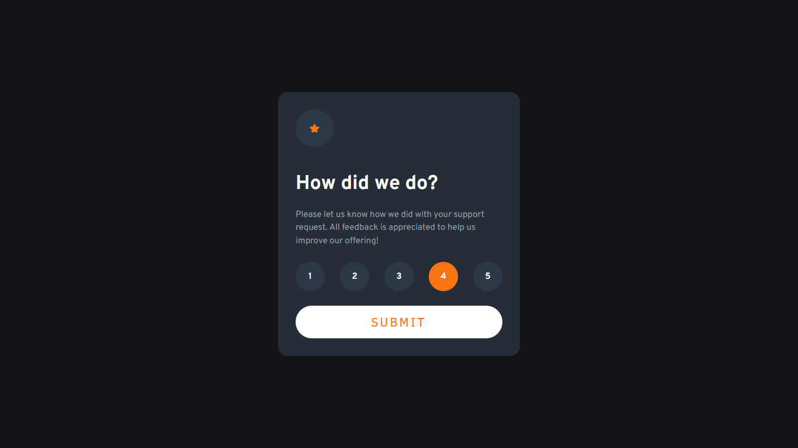
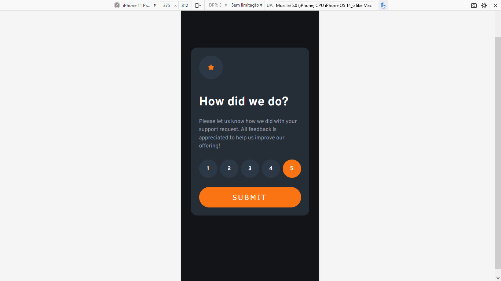
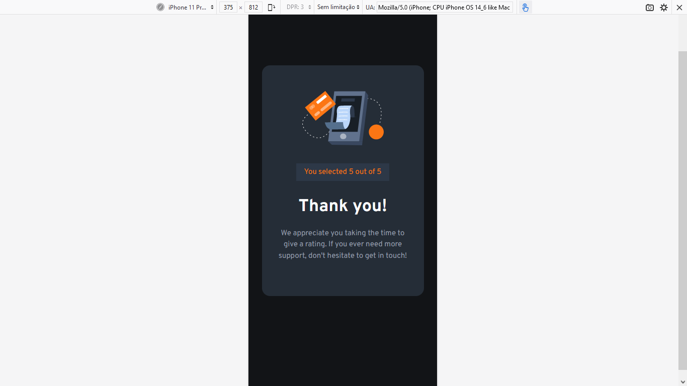
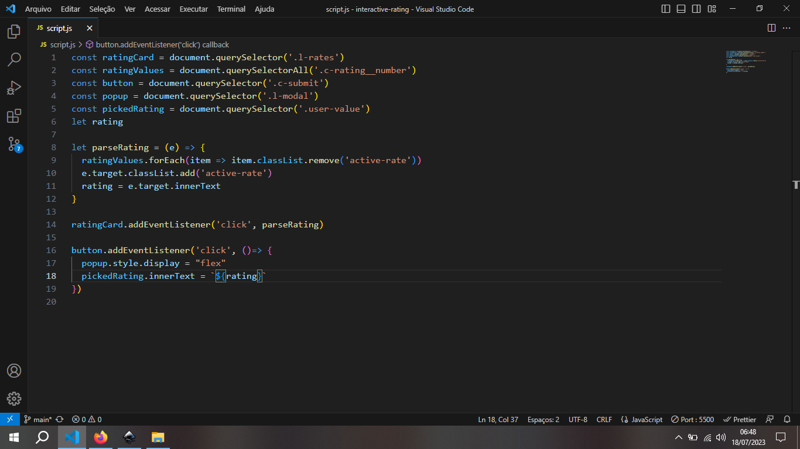

<h1>Interactive Rating FontEnd Mentor Challenge</h1>
 

Neste desafio, realizei novamente o HTML e CSS sem grandes dificuldades. Mais uma vez, a dificuldade ficou com a lógica da programação. Utilizei vários tutoriais da internet, mas sinceramente achei muitos diferentes do que ja tinha aprendido. Acabei utilizando um onde o tutor utiliza um forEach em cada elemento da lista para adicionar uma classe onde se muda o background do número da avaliação.

 

<h2>Layout Desktop.</h2>
 

 

<h2>Layout Desktop com hover na classificação.</h2>
 

 

<h2>Layout Desktop com hover na classificação e avaliação selecionada.</h2>
 

 

<h2>Layout Desktop com hover no botão Submit.</h2>
 

 

<h2>Layout Desktop com resultado exibido.</h2>
 

 

<h2>Layout Moile</h2>
 

 

<h2>Layout Mobile resultado.</h2>
 

 

<h2>Lógica aplicada.</h2>
 

 

 
<h3>Concluões sobre o desafio</h3>
 

Demorei um final de semana inteiro para resoçlver esse desafio. Inicialmente, utilizei uma lógivca gigantesca, fazendo uma constante para cada numero da avaliação, mas depois lembrei de um exercicío do Guanabara e procurei tutoriais pra deixr a lógica mais curta. Fiquei feliz em não desanimar e continuar procurando a solução. 

